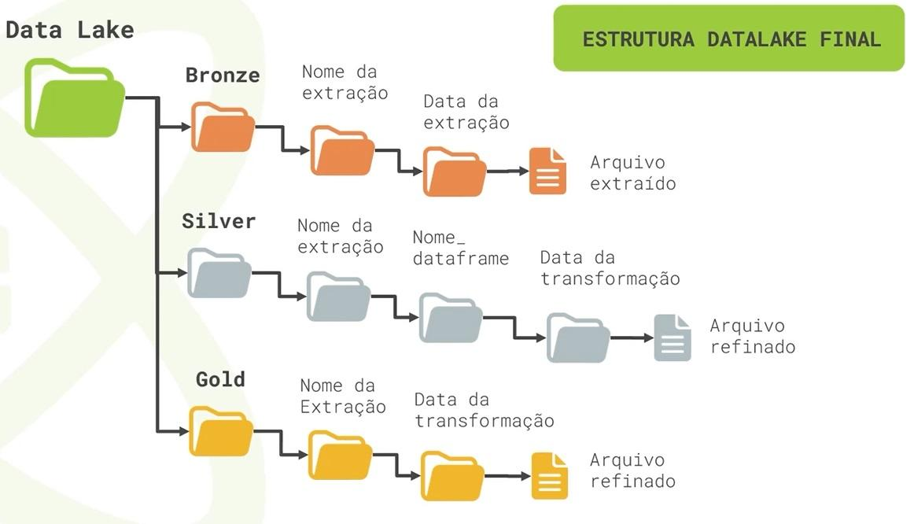

## Extração de Dados do Twitter com PySpark e Airflow

Este repositório contém um projeto para extrair dados do Twitter utilizando o Airflow e PySpark.

**Objetivo:**

O projeto tem como objetivo automatizar a extração de dados do Twitter e armazená-los em um data lake para análise posterior.

**Funcionalidades:**

- **Extração de dados do Twitter:** Utiliza o TwitterOperator para extrair dados do Twitter em intervalos de tempo configurados.
- **Processamento com PySpark:** Os dados extraídos são processados utilizando PySpark, permitindo a manipulação eficiente de grandes volumes de dados.
- **Armazenamento em Data Lake:** Os dados processados são armazenados em um data lake (localizado em `datalake/`) utilizando a estrutura JSON.
- **Agendamento de tarefas:** O Airflow gerencia o agendamento das tarefas de extração, garantindo a coleta regular de dados.
- **Gerenciamento de dependências:** O Airflow garante a execução das tarefas na ordem correta, definindo as dependências entre elas.

**Requisitos:**

- Python 3.x
- Airflow instalado e configurado
- PySpark instalado
- Bibliotecas Python necessárias: `requests`, `twitter`, `json`, etc.

**Instalação:**

1. Clone este repositório: `git clone https://github.com/anselmoaxo/extracao-twitter-airflow.git`
2. Crie um ambiente virtual Python: `python3 -m venv env`
3. Ative o ambiente virtual: `source env/bin/activate`
4. Instale as dependências: `pip install -r requirements.txt`

**Configuração:**

1. Configure as credenciais da API do Twitter no arquivo `twitter_hook.py`.
2. Configure o caminho do data lake no arquivo `twitter_operator.py`.
3. Defina o cronograma de extração no arquivo `twitter_dag.py`.

**Execução:**

1. Inicie o servidor Airflow: `airflow standalone`
2. Acesse o webserver do Airflow em `http://localhost:8080`
3. Execute o DAG "TwitterDAG" através da interface do webserver.

**Documentação:**

- [Documentação do Airflow](https://airflow.apache.org/docs/stable/)
- [Documentação da API do Twitter](https://developer.twitter.com/en/docs/twitter-api)
- [Documentação do PySpark](https://spark.apache.org/docs/latest/api/python/)

**Contribuições:**

- Contribuições são bem-vindas! Envie um Pull Request com suas melhorias.

**Licença:**

Este projeto é licenciado sob a [Licença MIT](LICENSE).

**Observações:**

- Este projeto é um exemplo básico de extração de dados do Twitter utilizando o PySpark e Airflow.
- As instruções de configuração e execução podem variar de acordo com o seu ambiente.
- Para uso em produção, é importante adicionar testes unitários e testes de integração.
